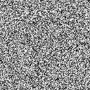
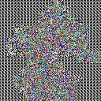
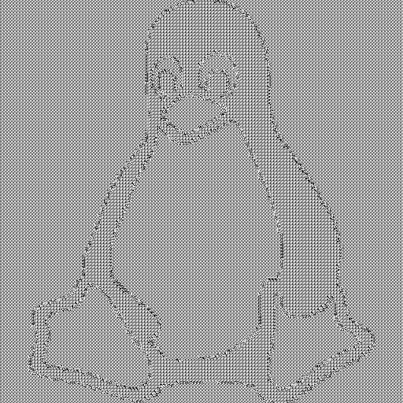
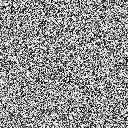
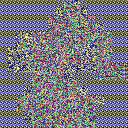
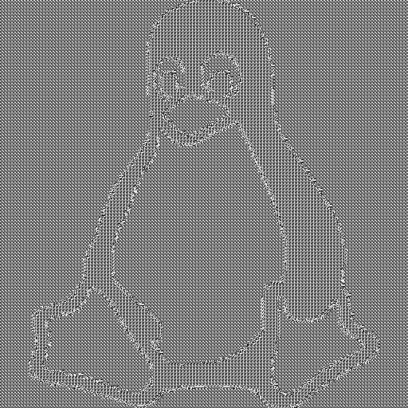
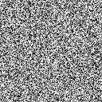
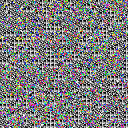
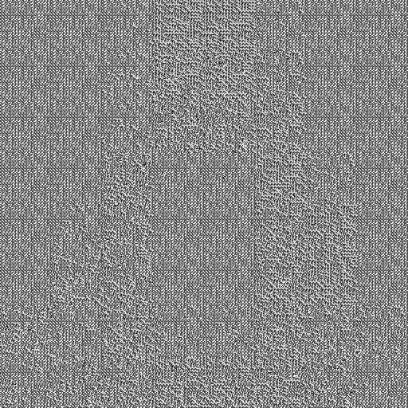

# Modified-AES

The objective of this project is to implement: **S. H. Kamali, R. Shakerian, M. Hedayati and M. Rahmani, "A new modified version of Advanced Encryption Standard based algorithm for image encryption," 2010 International Conference on Electronics and Information Engineering, Kyoto, 2010, pp. V1-141-V1-145**.

This paper introduces a modified version of the AES algorithm and compares it with the original AES algorithm when applied to image data, in the **ECB (Electronic Code Book) block cipher mode of operation**. It can be observed that the original AES algorithm, when applied to image data in the ECB mode, retains redundancies in the original image when encrypted, such that the original image is still intelligible to some extent. The modified AES algorithm (MAES), featuring a change in the ShiftRows transformation, aims to decrease the retention of image information upon encryption.

We also propose a new algorithm **SMAES (Shuffled Modified AES)**, which builds on MAES, to reduce redundancies and pattern retention in the encrypted images, for ECB mode of operation. The proposed approach introduces two new changes to MAES: using inverted keys to encrypt adjacent blocks of data, and performing a shuffling operation on the encrypted output image of MAES. The results of SMAES are compared with those of MAES, and a statistical analysis is performed.

All statistical analysis was carried out in MATLAB, for rendering histograms, correlation and covariance plots. Run-time analysis was performed on an 8GB memory system powered by an *Intel(R) Core(TM) i7-8550U CPU @ 1.80GHz* processor running Ubuntu 18.04.
<hr>

## Usage

1. Clone the repository locally.
2. Change current working directory to the repository. 
3. Edit filepaths for the input textfile and output textfile as desired in *src/demo.cpp*
4. Run the following commands:
   ```shell
   $ make
   $ ./demo
   ```
5. For viewing the resulting encrypted and decrypted text files as images, run:
   ```shell
   $ python save_images.py -ip input-path -op output path
   ```
   Replace `input-path` and `output-path` of the above command with the path to text files to be converted into a single image, and path    to output image file respectively. Note that the script `save_image.py` attempts to convert *all* textfiles in the specified directory    (not sub-directories) to a single image. Hence, it is suggested to save text files related to a single image rendering in a separate      location.  
<hr>

# Results
### AES

|Original Image|Encrypted Image|Decrypted Image|
|:---:|:---:|:---:|
||||
||||
||||

### MAES 

|Original Image|Encrypted Image|Decrypted Image|
|:---:|:---:|:---:|
||||
||||
||||

### SMAES (Proposed approach)

|Original Image|Encrypted Image|Decrypted Image|
|:---:|:---:|:---:|
||||
||||
||||
<hr>

# Comparative Analysis

A comparative analysis of the single channel popular *ECB Penguin* `(512 X 512)` is performed below. It can be seen clearly that SMAES performs better in terms of all three parameters: entropy, correlation and covariance.
<br>

| |Original|AES|MAES|SMAES|
|:---:|:---:|:---:|:---:|:---:|
|**Entropy (bits/symbol)**|*0.771*|*5.2983*|*5.2774*|*5.9372*|
|**R<sub>XY</sub>**|*0.9705*|*0.8739*|*0.8929*|*-0.1427*|
|**Covariance**|*1.1067 x 10<sup>4</sup>*|*3.477 x 10<sup>3</sup>*|*4.0596 x 10<sup>3</sup>*|*-707.2074*|
<br>

This difference becomes evident when observing the encrypted penguin images obtained in the case of MAES and SMAES, as shown below. MAES clearly retains the edge information in the original penguin image, while SMAES shows more promising results.

|MAES|SMAES|
|:---:|:---:|
|||
<hr>

# Run-time Analysis

Analysis of the time required to encrypt and decrypt a single channel `512 x 512` image (penguin) is as shown below.

| |AES|MAES|SMAES|
|:---:|:---:|:---:|:---:|
|**Encryption**|*0.29 s*|*0.29 s*|*0.36 s*|
|**Decryption**|*0.75 s*|*0.77 s*|*0.85 s*|
|**Encryption + Decryption**|*1.04 s*|*1.06 s*|*1.21 s*|

## *Notes*

- SMAES introduces the computational overhead of shuffling the sub-blocks of the encrypted output from MAES according to a mapping defined by the S-Box of the AES algorithm. 
- The algorithm does not impair the parallelizability of the ECB mode of AES, as the new *(row,col)* value of each byte in a block is independent of the new value of a byte in any other block. 
- Although the run-time increased slightly due to this added computation, the parallelizability of the ECB mode of AES is preserved. These results have been obtained using no parallelization.
- After accordingly parallelizing the algorithm, it is expected that the run time would be significantly less, and the image would be effectively encrypted with little to no pattern retention, as demonstrated in the case of the Mickey and Penguin images.
